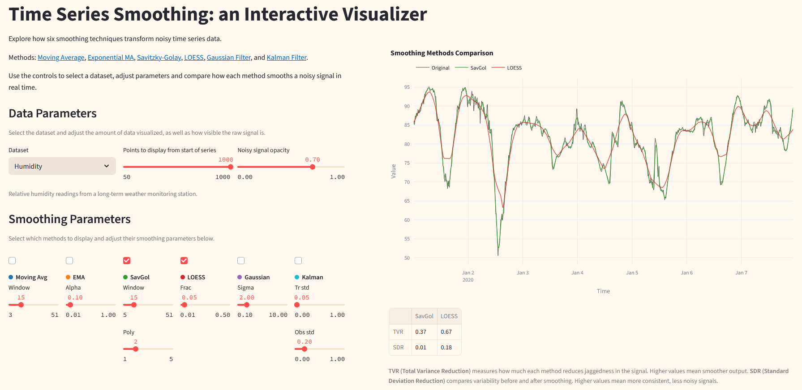

  

# Time Series Smoothing Visualizer

An interactive Streamlit app for exploring time series smoothing methods across a variety of datasets. 

The app was built to demonstrate different smoothing techniques and how they affect noisy time series data.

The methods visualized are: Moving Average, Estimated Moving Average, Savitzky-Golay, LOESS, Gaussian filter, and Kalman filter.

This directory also includes a notebook with some initial plotting and exploration of the noisy sine dataset.

## Datasets and Licensing

This project uses a mix of real-world and synthetic datasets. Below are the licensing details for each:

| Dataset                     | Source & Description                                                                                                      | License                                                                 |
|----------------------------|---------------------------------------------------------------------------------------------------------------------------|-------------------------------------------------------------------------|
| **Sunspots**               | [Daily total sunspot number](https://www.sidc.be/SILSO/datafiles) from SILSO.                                              | [CC BY-NC 4.0](https://creativecommons.org/licenses/by-nc/4.0/)         |
| **Humidity (RH)** & **Wind Speed (WV)** | [Weather Long-term Time Series Forecasting](https://www.kaggle.com/datasets/alistairking/weather-long-term-time-series-forecasting) on Kaggle. | [MIT License](https://www.mit.edu/~amini/LICENSE.md)                   |
| **Noisy Sine**             | Synthetic noisy sine wave. Generated for this project.                                                                      | None                                               |
| **Process Modes and Anomalies** | Synthetic dataset simulating industrial process behavior with different operating modes and anomalies. Generated for this project.                                                 | None                                               |

